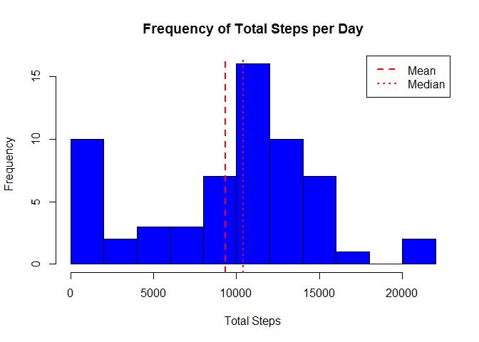
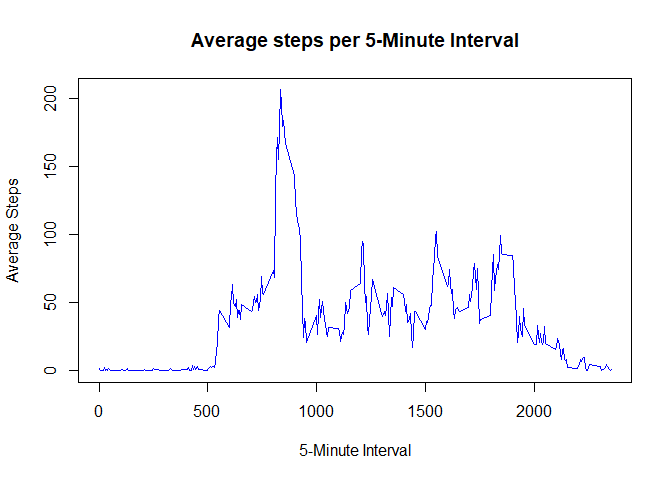
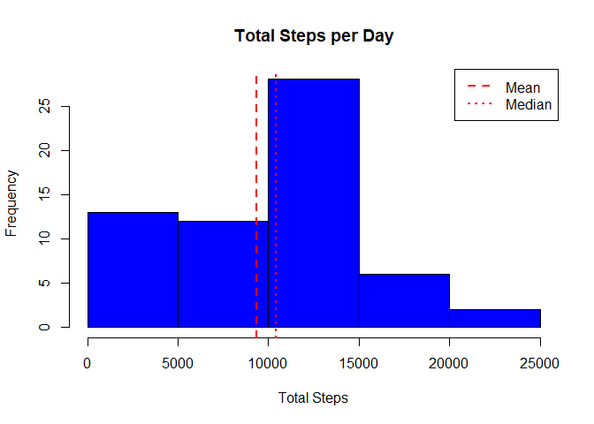
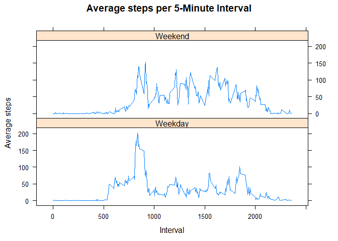

```r
knitr::opts_chunk$set(echo=TRUE,warning=FALSE, error=FALSE, message=FALSE)
```
## Background
This report was prepared for the JHU Reproducible Research Course, week 2 assignment. 

An analysis was performed on data generated from a study which measured the number of steps a test subject took over a 2 month period. A commercial personal movement device was worn and counted the number of step, in 5 minute intervals, 24hrs per day.  

## Loading and preprocessing the data

First packages required for data processing and analysis must be loaded:    

```r
library("dplyr")
library("lattice")
library("knitr")
```

Data from the study is located in this GIT hub repository. The data is contained in a comma-separated-value(CSV) file, and should comprising 3 fields and 17568 observations.


```r
df<-read.csv("./activity.csv",header=TRUE)
dim(df)
```

```
## [1] 17568     3
```

```r
head(df,3)
```

```
##   steps       date interval
## 1    NA 2012-10-01        0
## 2    NA 2012-10-01        5
## 3    NA 2012-10-01       10
```

Each question and analysis below requires the data to be prepared in a specific way. This will be covered in the sections below.

## What is mean total number of steps taken per day?
In order to calculated the average number of steps per day, we must first determine the total number of steps per day. The data must be grouped by date and the summarise() function can then be used to calculate the total steps per day. NA values are ignored and removed from the analysis using the rm.na setting.


```r
dfg<-group_by(df,date)
dfs <- summarise(dfg,TotalSteps=sum(steps,na.rm=TRUE))
```

To understand the distribution of results, data is plotted in a histogram

```r
hist(dfs$TotalSteps,
     col="blue",
     main="Frequency of Total Steps per Day",
     xlab="Total Steps",
     breaks=10)

# Calculate the mean and median total steps per day. Round to mean whole number
MeanSteps<-mean(dfs$TotalSteps,na.rm=TRUE)
MeanSteps<- round(MeanSteps,0)
MedianSteps<-median(dfs$TotalSteps,na.rm=TRUE)
MedianSteps<-as.integer(MedianSteps)


# plot the mean and median lines
abline(v=MeanSteps,lty=2,lwd=2,col="red")
abline(v=MedianSteps,lty=3,lwd=2,col="red")

# add legend
legend("topright", lty=c(2,3),lwd=2,col="red",legend=c("Mean","Median"))
```

<!-- -->

The mean total number of steps per day is 9354 and the median total number of steps is 10395.

## What is the average daily activity pattern?

To understand how activity changes throughout the day, data must be grouped by interval. The average number of steps can the be calculated for the same interval across all the days included in the study.  


```r
dfi<-group_by(df,interval)
dfia<-summarise(dfi,AverageSteps=mean(steps,na.rm=TRUE))
```

Create A time series line plot to visualize the trend in average activity trend throughout the day.  

```r
with(dfia,plot(interval,
               AverageSteps,
               type="l",
               col="blue",
               main="Average steps per 5-Minute Interval",
               xlab="5-Minute Interval",
               ylab="Average Steps"))
```

<!-- -->

```r
# find which interval has the highest average using grep to return the interval number that matches to
# the max average.
MaxSteps <- dfia[grep(max(dfia$AverageSteps),dfia$AverageSteps),]
MaxSteps$AverageSteps <- round(MaxSteps$AverageSteps,0)
```

The interval 835 has the highest average activity of 206 steps.

## Imputing missing values

Determine the number of missing (NA) values in the data set:

```r
NumberNA=sum(is.na(df))
```

The number of records with missing data is 2304.  

The missing values may influence the results and analysis. To understand the impact, the missing values will be replaced with the following:  
- Daily mean number of steps  
- 0 steps if there are no steps recorded for a day (all records NA)  

Calculate the daily mean number of steps:

```r
dailyaverage<-summarise(dfg,AverageSteps=mean(steps,na.rm=TRUE))
```

For comparison with the original data frame, a duplicate data frame is created.  
To find the missing values, we loop through the data frame and check for NA values and are replaced as required.  

```r
#duplicate original data frame
dfcomplete<-df

# loop through all records in 
for (i in 1:nrow(dfcomplete)) 
{
  if(is.na(dfcomplete[i,]$steps))   # check if steps = NA
  {
    rownum<-grep(dfcomplete[i,]$date,dailyaverage$date)   # find the daily average
    
    if(!is.na(dailyaverage[rownum,]$AverageSteps))    # check is daily average is not NA
       {
        dfcomplete[i,]$steps<-dailyaverage[rownum,]$AverageSteps   # set to daily average
        }
    else   # daily average is  NA
    {
      dfcomplete[i,]$steps<-0.0      # set steps 0
    }
  }
}
```

Confirm all missing (NA) values have been replaced:  

```r
NumberNAComplete=sum(is.na(dfcomplete))
```

The number of records with missing data is now 0 compared to 2304 .  

To compare to the original result, the complete data frame is prepared by grouping by date and calculating the total steps per day.

```r
dfcompleteg<-group_by(dfcomplete,date)
dfcompletes <- summarise(dfcompleteg,TotalSteps=sum(steps,na.rm=TRUE))
```

Plot a histogram of the results:  

```r
hist(dfcompletes$TotalSteps,col="blue",main="Total Steps per Day",xlab="Total Steps")

# Calculate the mean and median total steps per day. Round to mean whole number
MeanStepsComplete<-mean(dfcompletes$TotalSteps,na.rm=TRUE)
MeanStepsComplete<- round(MeanSteps,0)
MedianStepsComplete<-median(dfcompletes$TotalSteps,na.rm=TRUE)
MedianStepsComplete<-as.integer(MedianStepsComplete)


# plot the mean and median lines
abline(v=MeanStepsComplete,lty=2,lwd=2,col="red")
abline(v=MedianStepsComplete,lty=3,lwd=2,col="red")

# add legend
legend("topright", lty=c(2,3),lwd=2,col="red",legend=c("Mean","Median"))
```

<!-- -->

The mean total number of steps per day is now 9354 compared to 9354.  
The median total number of steps is now 10395 compared to 10395.

Therefore replacing missing values with the average value, instead of ignoring them does not change the mean or median results.  


## Are there differences in activity patterns between weekdays and weekends?

Using the same data frame from the previous section, we want to understand if the activity pattern changes from weekdays to weekends.

The dataframe must be updated with the day of the week and  classified as a weekday or weekend:

```r
# add a new field containing the day of the week using weekdays(). the date field is character class
# so is temporarily converted to a date class with as.Date()
dfcomplete<-mutate(dfcomplete,DayofWeek=weekdays(as.Date(date,"%Y-%m-%d")))

# create 2 vectors. First contains the days of the week to match with the DayofWeek field. 
# second is the factor for grouping weekdays and weekends\

daynames<-c("Monday","Tuesday","Wednesday","Thursday","Friday","Saturday","Sunday")
WDWE<-c("Weekday","Weekday","Weekday","Weekday","Weekday","Weekend","Weekend")

#create a factor variable based o the day of the week from dfcomplete
dayfactor<-factor(dfcomplete$DayofWeek,levels=daynames,labels=WDWE)

# join the factor variable to the data frame
dfcomplete<-mutate(dfcomplete,DayFactor=dayfactor)
```

Now the data set is prepared, it is grouped by DayFactor (weekend/weekday) and the interval.  

```r
dfcompletei<-group_by(dfcomplete,DayFactor,interval)
dfcompleteia<-summarise(dfcompletei,AverageSteps=mean(steps,na.rm=TRUE))
```


The trends for Weekday and Weekend activity are best understood with a time series plots for each.

```r
p<-xyplot(dfcompleteia$AverageSteps~dfcompleteia$interval|dfcompleteia$DayFactor,
          data=dfcompleteia,
          layout=c(1,2),
          type="l",
          xlab="Interval",
          ylab="Average steps", 
          main="Average steps per 5-Minute Interval")
print(p)
```

<!-- -->

More activity is observed on weekday mornings however the overall average number of steps is higher during the weekend. This indicates the test subject may have been an office based worked who had a higher number of steps commuting to work and spent the day at their desk.  
